# Kubernetes 网络从零到精通 · 资深学习手册

> **基准版本**：Kubernetes v1.28.15 | Calico v3.26.4 | Cilium（参考对比）| MetalLB v0.14.x
> 版本敏感的行为差异会标注版本边界。版本不同时以 `kubectl version` 与[官方 changelog](https://github.com/kubernetes/kubernetes/blob/master/CHANGELOG) 为准。

---

## 阅读路径

| 你是谁 | 建议阅读顺序 |
|--------|-------------|
| **零基础**（不懂网络/K8s） | 第一章(OSI) → 第二章(K8s 网络模型) → 第三章(Service) |
| **想搞清流量怎么走** | 第四章(kube-proxy) → 第五章(Pod 通信) → 第七章(外部流量) |
| **选型/对比 CNI** | 第六章(CNI 对比) |
| **运维/排障** | 第八章(配置修改) → 第九章(故障排查) |
| **已有经验,查配置** | 直接跳附录(速查表 + 官方链接) |

---

## 第一章 网络基础：OSI 七层模型与 K8s

> 读完本章你能做到：理解 L2/L3/L4/L7 分别是什么层、K8s 网络涉及哪几层、为什么 MetalLB 的 VIP 能 curl 通却 ping 不通。

### 1.1 OSI 七层模型（通俗版）

网络通信可以想象成**寄快递的分工体系**——从打包到运输到签收,每一层只管自己的事。OSI(开放系统互连)模型把网络通信分成 7 层,每层有明确职责:

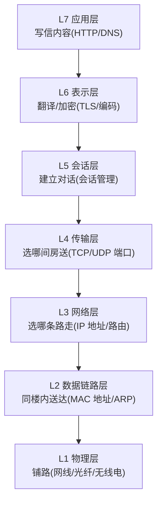

> 实际工程中常简化为 **TCP/IP 四层模型**（应用/传输/网络/链路），但讨论 K8s 网络时用 L2/L3/L4/L7 这四个关键层就够了。

### 1.2 K8s 网络涉及的四个关键层

在 Kubernetes 集群里，不同组件工作在不同的 OSI 层。理解这一点是理解所有后续内容的基础:

| 层 | 全称 | 通俗类比 | K8s 中谁在这层工作 | 关键概念 |
|:--:|------|---------|-------------------|---------|
| **L2** | 数据链路层 | 同一栋楼内送信——只认门牌号(MAC),只在本楼(广播域)内有效 | MetalLB L2(ARP 应答)、交换机、veth pair | MAC 地址、ARP、广播域 |
| **L3** | 网络层 | 跨城寄信——认地址(IP),需要路由器/导航转发 | Pod IP 分配、CNI 路由、IPIP/VXLAN 封装、kube-ipvs0 | IP 地址、路由表、子网 |
| **L4** | 传输层 | 信送到后——认具体哪间房(端口号) | kube-proxy(iptables/IPVS)、Service 端口、NodePort | TCP/UDP、端口、DNAT |
| **L7** | 应用层 | 信打开后——读内容决定干什么 | Ingress Controller(读 HTTP Host/Path)、CoreDNS | HTTP、Host 头、URL 路径 |

> **参考**：[OSI model - Wikipedia](https://en.wikipedia.org/wiki/OSI_model) | [Kubernetes Networking Model](https://kubernetes.io/docs/concepts/cluster-administration/networking/)

### 1.3 为什么理解 OSI 层对 K8s 网络很重要

一个典型困惑："MetalLB 的 VIP 能 `curl` 通(HTTP 200),但 `ping` 不通——这正常吗？"

答案是**正常的**,原因就在 OSI 分层:

- `curl http://VIP:80` 是 **L7**(HTTP) → 经过 **L4**(TCP 端口 80) → kube-proxy IPVS 有规则匹配 `TCP VIP:80` → DNAT(目标地址转换——把"收件地址"从 VIP 改写成 Pod 的真实 IP)转发到 Pod → **通**
- `ping VIP` 使用 **L3** 的 ICMP 协议(Internet Control Message Protocol,用来"探路",不携带端口号) → ICMP 不属于任何 TCP/UDP 端口 → kube-proxy IPVS **没有匹配规则** → VIP 又没真正绑到任何活的协议栈(挂在 dummy 网卡 kube-ipvs0 上) → 内核丢弃 → **不通**

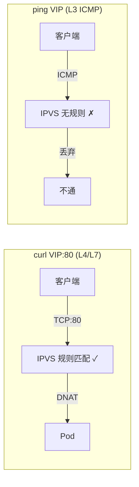

**结论**：MetalLB L2 模式的 LoadBalancer VIP 是**四层(L4)端口级虚拟 IP**——它只为 Service 声明的端口(如 TCP 80/443)服务。ICMP(ping)不属于任何 Service 端口,所以 ping 不通是**设计使然,不是故障**。

> 类比：VIP 像公司的总机电话号码——你打具体分机号(端口)能接通，但你"喊一声"(ping)没人应——因为总机只转接分机呼叫,不回应"喊话"。

### 1.4 其他 L 层能不能 ping 通？

| 目标 | 能 ping 通吗 | 为什么 |
|------|:---:|------|
| 节点真实 IP (192.168.104.104) | ✅ | L3 真实主机地址,内核协议栈正常回 ICMP |
| Pod IP (10.244.x.x) | ✅ (集群内) | Pod 有完整协议栈,内核回 ICMP |
| ClusterIP (10.96.x.x) | ❌ | 同 VIP——挂 kube-ipvs0/iptables 规则,只处理声明端口 |
| LoadBalancer VIP (MetalLB) | ❌ | 同上 |
| kube-vip 的控制平面 VIP | ✅ | kube-vip 把 VIP **真正 `ip addr add` 绑到网卡** → 有协议栈 → 回 ICMP |

**关键区分**：kube-vip 和 MetalLB 虽然都提供 VIP,但机制完全不同——kube-vip 是"真绑 IP 到网卡"(L3 可达),MetalLB L2 是"只应答 ARP+引导流量到 IPVS"(L4 端口级)。

### 1.5 什么是 ARP——理解 L2 的关键

**ARP(地址解析协议)** 是 L2 层的"喊话找人"机制:

> 类比：你在办公室里喊"谁是 192.168.104.222？请举手告诉我你的工位号(MAC)"——只有同一办公室(广播域)里的人能听到。

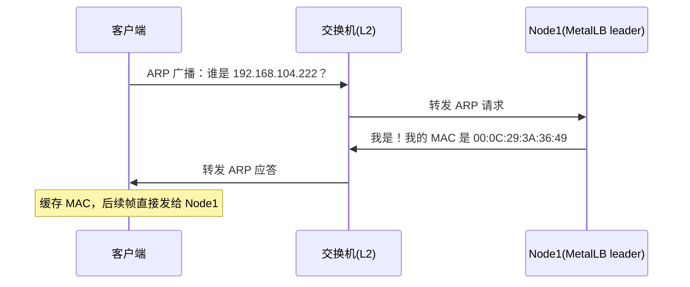

MetalLB L2 模式就是利用 ARP 机制——leader 节点的 speaker 代替 VIP 应答 ARP,把流量"骗"到自己节点,再由 kube-proxy 转发到 Pod。

> **参考**：[RFC 826 - ARP](https://datatracker.ietf.org/doc/html/rfc826) | [MetalLB L2 概念](https://metallb.io/concepts/layer2/)

---

## 第二章 K8s 网络模型与核心组件

> 读完本章你能做到：说出 K8s 网络的三大原则、知道 kube-proxy/CNI/CoreDNS 各自负责什么。

### 2.1 K8s 网络三大原则

Kubernetes 对集群网络有三条**硬性要求**（不满足则不算合格的 K8s 网络实现）:

1. **所有 Pod 可以互相通信，无需 NAT** — 任何 Pod 都能直接用对方的 Pod IP 访问对方
2. **所有节点可以与所有 Pod 通信，无需 NAT** — 节点上的进程(如 kubelet)能直连任何 Pod
3. **Pod 看到的自身 IP = 别人看到的它的 IP** — 不存在"内外两个 IP"的困惑

> 这三条规则定义在官方文档 [Cluster Networking](https://kubernetes.io/docs/concepts/cluster-administration/networking/)。CNI 插件(Flannel/Calico/Cilium)就是实现这三条规则的具体方案。

### 2.2 三大网络组件的职责划分

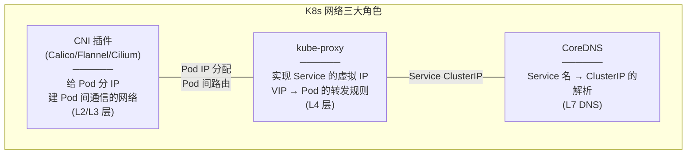

| 组件 | 负责什么 | 不负责什么 |
|------|---------|-----------|
| **CNI 插件** | 给 Pod 分配 IP、建立 Pod 间网络(同主机+跨主机) | 不管 Service、不管外部暴露 |
| **kube-proxy** | 把 Service VIP 的流量转发到后端 Pod(DNAT) | 不管 Pod 间直接通信、不管 L7 路由 |
| **CoreDNS** | 把 Service 名解析成 ClusterIP | 不做流量转发 |
| **Ingress Controller** | L7 路由(HTTP Host/Path) | 不管 L4 转发(那是 kube-proxy 的事) |
| **MetalLB** | 给 LoadBalancer Service 分配外部 VIP + ARP/BGP 通告 | 不做 L4 转发(那是 kube-proxy 的事) |

> **核心认知**：K8s 网络不是一个组件搞定的，而是**多个组件各管一层**,协作完成从"Pod 分 IP"到"外部可达"的完整链路。理解每个组件的边界是排障的基础。

### 自测问题

1. 为什么 MetalLB 的 VIP 能 curl 通但 ping 不通？（提示：想想 VIP 在 OSI 哪一层工作）
2. CNI 插件和 kube-proxy 有什么区别？（提示：一个管 Pod IP,一个管 Service VIP）
3. 如果 CoreDNS 挂了,`curl http://10.96.0.1:443` 能通吗？（提示：用 IP 直接访问不经过 DNS）

---

## 第三章 Service 四种类型与流量路径

> 读完本章你能做到：说出 K8s Service 四种类型各自的可达范围，画出每种类型的流量路径。

Service 是 K8s 对一组 Pod 的**稳定访问入口**。Pod 随时可能重建(IP 变化)，但 Service 的 **ClusterIP**（虚拟总机号）永远不变——这就是 Service 存在的意义。

> **参考**：[Service 官方文档](https://kubernetes.io/docs/concepts/services-networking/service/)

### 3.1 四种类型总览

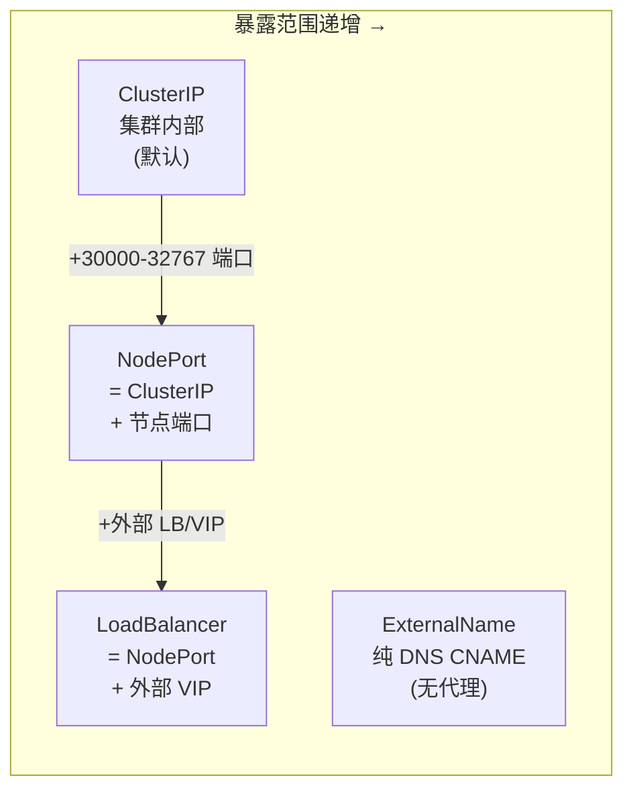

| 类型 | 分配什么 | 谁能访问 | 典型用途 |
|------|---------|---------|---------|
| **ClusterIP** | 虚拟 IP(如 10.96.x.x) | 仅集群内 Pod/Node | 微服务间调用 |
| **NodePort** | ClusterIP + 每节点 IP:30000-32767 | 集群外(经任意节点 IP) | 开发测试暴露 |
| **LoadBalancer** | ClusterIP + NodePort + 外部 VIP | 集群外(经 LB VIP) | **生产对外服务** |
| **ExternalName** | 无 IP,只有 DNS CNAME | DNS 层面 | 引用外部服务(如 RDS) |

> NodePort 端口范围由 kube-apiserver `--service-node-port-range` 控制,默认 30000-32767。[官方文档](https://kubernetes.io/docs/concepts/services-networking/service/#nodeport)

### 3.2 ClusterIP 流量路径

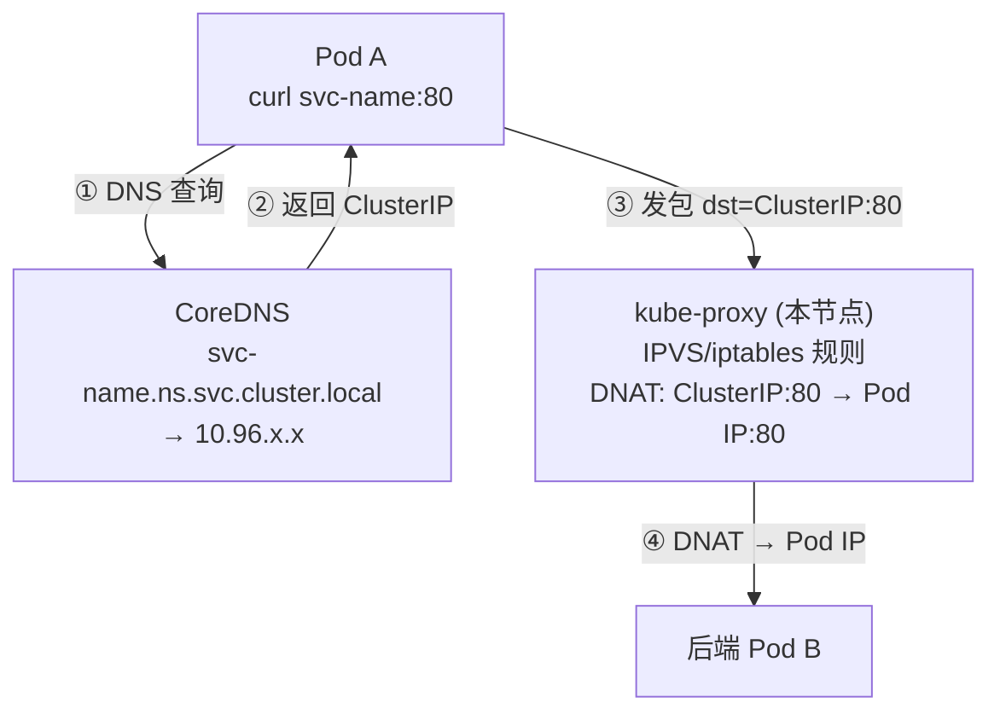

ClusterIP 是最基础的类型——纯集群内可达,外部无法直接访问。**DNAT**（目标地址转换）是核心动作：kube-proxy 把"发给 Service 虚拟 IP"的包改成"发给具体 Pod 的真实 IP"。

### 3.3 NodePort 流量路径

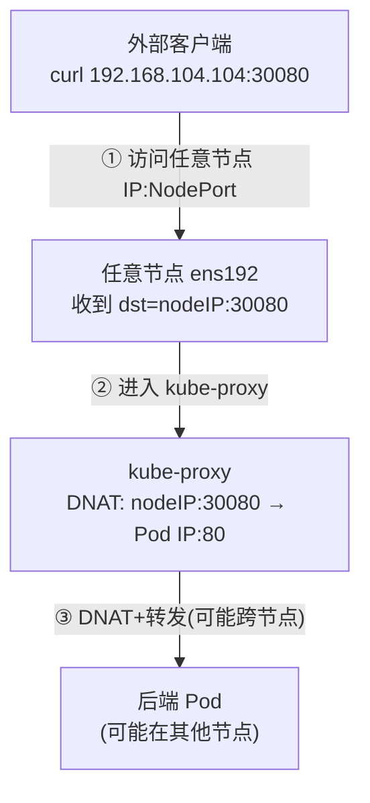

NodePort = ClusterIP + 在**每个节点**开一个端口监听。外部流量可经任意节点 IP 的该端口进入,kube-proxy 再 DNAT 到后端 Pod。

### 3.4 LoadBalancer 流量路径

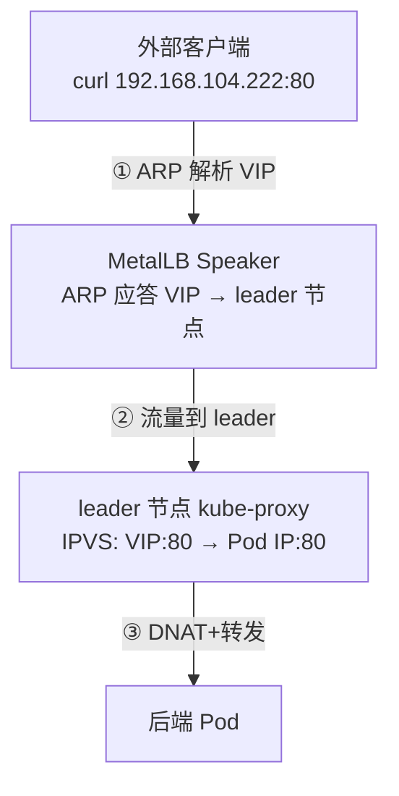

LoadBalancer = ClusterIP + NodePort + **外部 VIP**。裸金属用 MetalLB 提供 VIP(L2 ARP 或 BGP),云上用云 LB(ALB/NLB/ELB)。

### 3.5 ExternalName（纯 DNS,无代理）

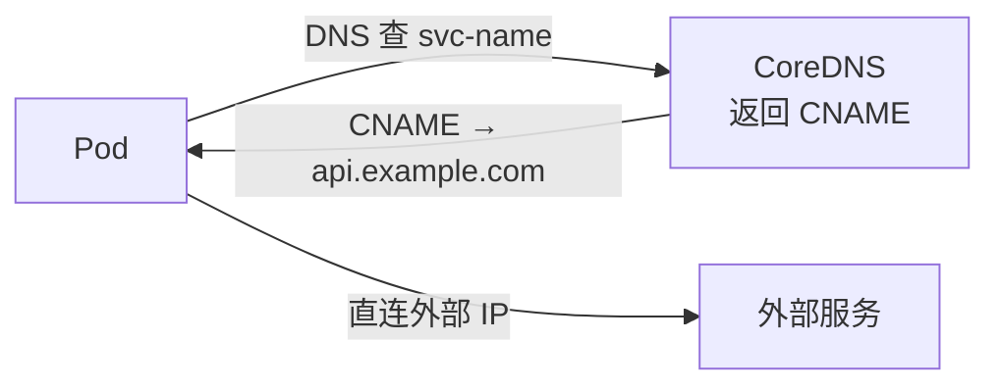

ExternalName **不经过 kube-proxy**,没有 ClusterIP,纯 DNS CNAME。用于在集群内用统一名字引用外部依赖(如 RDS 数据库)。

### 3.5.1 Service 内部流转全景：从入口到 Endpoint

> 读完本段你能画出：一个外部请求进入集群后,经过哪些"层层嵌套"的 Service 组件才最终到达 Pod。

K8s 的 Service 不是单一组件——它是一个**层级嵌套结构**,每种类型都"包含"前一种:

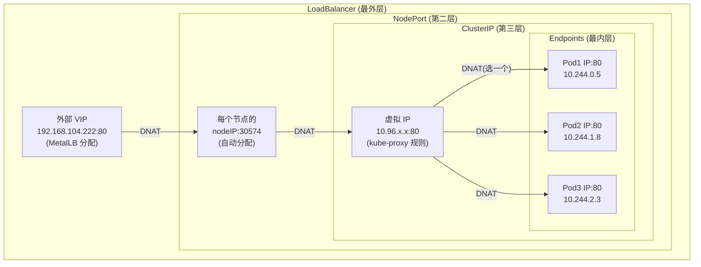

**核心概念：Endpoints**

Endpoints 是 Service 的"真正后端列表"——**哪些 Pod 的 IP:Port 匹配了 Service 的 selector**。kube-proxy 最终做 DNAT 时,就是从这个列表里选一个。

```bash
# 查看 Service 的 Endpoints（实际后端 Pod IP 列表）
kubectl get endpoints <service-name>
# 或更详细
kubectl describe endpoints <service-name>
```

### 3.5.2 每种入口类型的完整流转（逐跳详解）

#### LoadBalancer 入口（本套使用：MetalLB + Ingress）

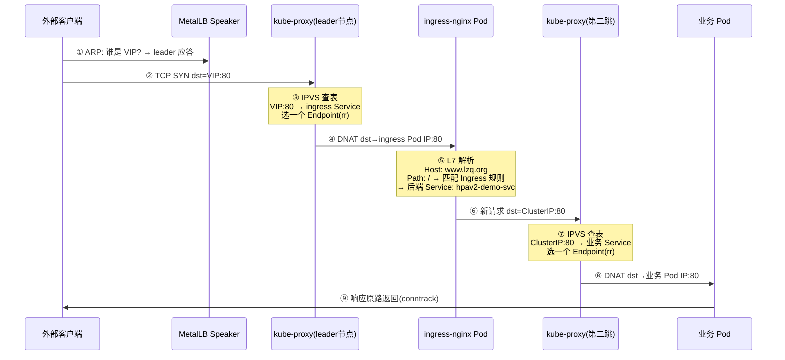

**关键点**：流量经过**两次 DNAT**——第一次从 VIP 到 ingress Pod,第二次从 ClusterIP 到业务 Pod。每次 DNAT 都是 kube-proxy 从 Service 的 Endpoints 列表里选一个后端。

#### NodePort 入口

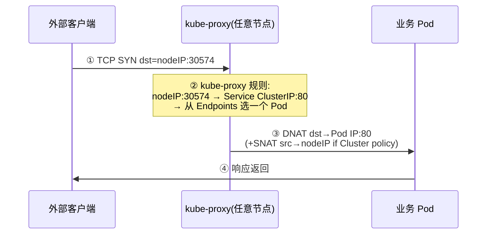

**关键点**：NodePort 实际是"NodePort → ClusterIP → Endpoint"三层合一的**一次 DNAT**——kube-proxy 直接从 NodePort 跳到最终 Pod IP,不经过中间 ClusterIP 这一"逻辑层"（ClusterIP 只是规则匹配的入口,不是真正的中间跳）。

#### ClusterIP 入口（集群内 Pod 间调用）

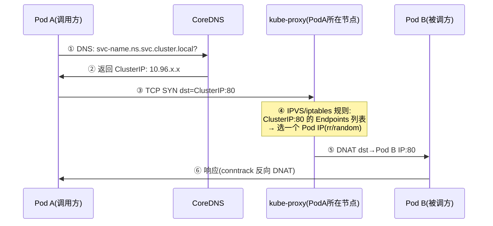

**关键点**：ClusterIP 不是一个真实的网卡/进程——它只存在于 kube-proxy 的规则里(iptables 链 / IPVS 虚拟服务)。DNS 解析到 ClusterIP 后,包在**发出的节点上就被 DNAT**——不需要"先到某个中间设备再转"。

### 3.5.3 Endpoint 选择机制

kube-proxy 从 Endpoints 列表选后端的算法取决于模式:

| kube-proxy 模式 | 选择算法 | 行为 |
|----------------|---------|------|
| **iptables** | statistic random probability | 概率均匀(3 个后端:1/3、1/2、1) |
| **IPVS** | rr(默认)/wrr/lc/sh/dh 等 11 种 | 可配(默认 rr 轮询) |

**Endpoints 怎么来的？**

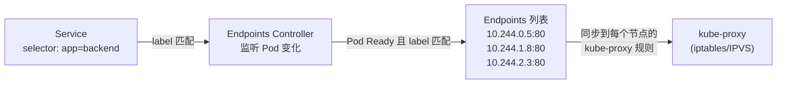

1. **Endpoints Controller**(运行在 kube-controller-manager 里)持续监听 Pod 变化
2. Pod 满足两个条件才进入 Endpoints 列表:① label 匹配 Service 的 selector ② Pod 状态为 **Ready**(readinessProbe 通过)
3. Endpoints 变化实时同步到每个节点的 kube-proxy → 更新 iptables/IPVS 规则
4. Pod NotReady 或被删除 → 从 Endpoints 移除 → kube-proxy 不再转发给它

> **参考**：[Service 官方文档 - Endpoints](https://kubernetes.io/docs/concepts/services-networking/service/#endpoints) | [EndpointSlices](https://kubernetes.io/docs/concepts/services-networking/endpoint-slices/)

### 3.5.4 EndpointSlice：大规模集群的 Endpoint 替代方案

> K8s 1.21+ 起 EndpointSlice 成为默认机制,替代传统 Endpoints 对象。理解它是理解大规模集群网络性能的关键。

#### 为什么需要 EndpointSlice？（传统 Endpoints 的瓶颈）

传统的 **Endpoints** 对象把一个 Service 的**所有后端 Pod IP** 存在一个对象里。问题：

- 一个 Service 有 5000 个 Pod → 一个 Endpoints 对象里存 5000 条记录
- 任何一个 Pod 变化(加/减/NotReady) → **整个 Endpoints 对象重新传输**到所有节点的 kube-proxy
- etcd 单对象大小有限制（默认 1.5MB）,5000+ 后端可能超限
- **网络放大效应**：1 个 Pod 变化 → 全集群所有节点收到完整 Endpoints 对象更新 → 浪费带宽和 kube-proxy CPU

#### EndpointSlice 的设计

EndpointSlice 把一个 Service 的后端**拆成多个小片(Slice)**,每片默认最多 **100 个 Endpoint**:

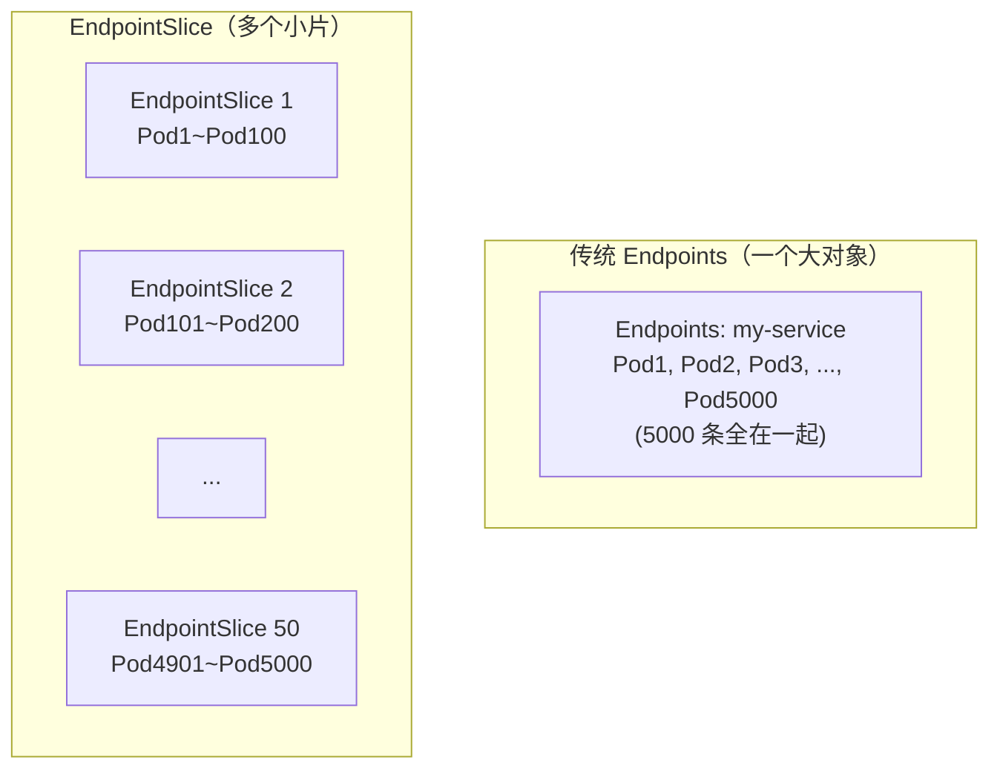

#### EndpointSlice 的优势

| 维度 | 传统 Endpoints | EndpointSlice |
|------|---------------|---------------|
| **更新粒度** | 任何变化 → 传输整个对象(5000 条) | 只传变化的那个 Slice(≤100 条) |
| **带宽消耗** | O(n) per change(n=总 Pod 数) | O(1) per change(固定 ≤100 条) |
| **etcd 压力** | 单对象可能超 1.5MB 限制 | 每个 Slice 很小,不会超限 |
| **kube-proxy 处理** | 收到完整列表,全量重算规则 | 只增量更新变化的那个 Slice |
| **拓扑感知** | 不支持 | ✅ 支持(可标注 Zone/Node 拓扑,就近路由) |
| **双栈** | 一个对象只能存一种 IP 族 | 一个 Slice 可标注 addressType(IPv4/IPv6/FQDN) |

#### 关键字段

```yaml
apiVersion: discovery.k8s.io/v1
kind: EndpointSlice
metadata:
  name: my-service-abc12
  labels:
    kubernetes.io/service-name: my-service   # ← 关联到哪个 Service
addressType: IPv4                            # IPv4 / IPv6 / FQDN
ports:
- name: http
  port: 80
  protocol: TCP
endpoints:
- addresses: ["10.244.0.5"]
  conditions:
    ready: true                              # ← Pod readiness
    serving: true                            # ← 正在服务(即使 terminating 也可能 true)
    terminating: false
  nodeName: node1                            # ← 所在节点(拓扑信息)
  zone: "cn-north-4a"                        # ← 可用区(拓扑感知路由用)
- addresses: ["10.244.1.8"]
  conditions:
    ready: true
  nodeName: node2
  zone: "cn-north-4b"
```

#### 与传统 Endpoints 的关系

- K8s 1.21+ 起 kube-proxy **默认使用 EndpointSlice**（不再用 Endpoints）做转发规则
- 传统 Endpoints 对象**仍自动生成**（向后兼容）,但 kube-proxy 不再读它
- 你 `kubectl get endpoints` 仍能看到,但那只是兼容层,真正驱动流量的是 `kubectl get endpointslices`

```bash
# 查看 EndpointSlice（真正驱动 kube-proxy 规则的）
kubectl get endpointslices -l kubernetes.io/service-name=my-service

# 对比传统 Endpoints（兼容层,不再驱动流量）
kubectl get endpoints my-service
```

#### 拓扑感知路由（Topology Aware Routing）

EndpointSlice 的 `zone` 字段支持**就近路由**——kube-proxy 优先把流量转到同可用区的 Pod,减少跨 AZ 延迟和流量费:

```yaml
# 启用拓扑感知(给 Service 加 annotation)
metadata:
  annotations:
    service.kubernetes.io/topology-mode: Auto   # K8s 1.27+ (替代旧的 topologyKeys)
```

> ⚠️ 前提：节点必须有 `topology.kubernetes.io/zone` label(云上自动有,裸金属需手动加)。

> **参考**：[EndpointSlice 官方文档](https://kubernetes.io/docs/concepts/services-networking/endpoint-slices/) | [Topology Aware Routing](https://kubernetes.io/docs/concepts/services-networking/topology-aware-routing/)

`externalTrafficPolicy` 控制 NodePort/LoadBalancer 收到外部流量后**是否允许跨节点转发**。只影响外部入站流量。

> **前置概念：SNAT（源地址转换）**= 改发件人地址。类比：你寄信时把"寄件人"从自己家地址改成公司前台地址——回信就寄到前台而不是你家。在 K8s 中，SNAT 把客户端源 IP 改成节点 IP，确保回包能沿原路返回。代价是后端 Pod 看不到真实客户端 IP。

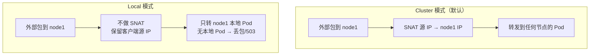

| 维度 | `Cluster`（默认） | `Local` |
|------|-------------------|---------|
| **客户端源 IP** | ❌ SNAT 后丢失 | ✅ 保留真实 IP |
| **负载均衡** | 均匀(所有节点 Pod 都可能收到) | 不均(只转本地 Pod) |
| **可用性** | 高(任何节点收到都能转) | 低(本节点无 Pod → 丢包超时; LB 经 healthCheck 返 503) |
| **适用** | 大多数场景 | 需要客户端 IP(日志/限流/地理位置) |

**修改方式**：

```bash
# 不依赖脚本，直接改集群
kubectl patch svc <service-name> -n <namespace> \
  -p '{"spec":{"externalTrafficPolicy":"Local"}}'
```

> **参考**：[Source IP / Traffic Policies](https://kubernetes.io/docs/tutorials/services/source-ip/) | [Virtual IPs](https://kubernetes.io/docs/reference/networking/virtual-ips/)

> ⚠️ **MetalLB L2 + Local 的陷阱**：L2 模式只有一个 leader 节点接收流量。若该节点恰好没有对应 Pod,`Local` 策略导致**所有外部请求 503**。建议:用 DaemonSet 保证每节点有 Pod,或用 `Cluster`。

---

## 第四章 kube-proxy 代理模式详解

> 读完本章你能做到：说出 iptables/IPVS/nftables 三种模式的数据流差异,知道 kube-ipvs0 是什么、为什么存在,能独立切换模式并排障。

kube-proxy 是每个节点上的**四层(L4)转发代理**——它不转发实际数据包(不是真正的代理),而是**写规则**(iptables 规则 / IPVS 虚拟服务),让内核按规则做 DNAT 转发。

> **参考**：[kube-proxy 官方文档](https://kubernetes.io/docs/reference/networking/virtual-ips/) | [kube-proxy 命令参考](https://kubernetes.io/docs/reference/command-line-tools-reference/kube-proxy/)

### 4.1 三种模式对比

| 维度 | iptables（默认） | IPVS（本套用） | nftables |
|------|-----------------|----------------|----|
| **内核机制** | netfilter iptables NAT 表 | 内核 IPVS 模块(哈希表) | nftables verdict map |
| **是否新增网卡** | 否 | **是：`kube-ipvs0`** (dummy) | 否 |
| **查找复杂度** | O(n) — 规则逐条匹配 | **O(1)** — 哈希表查找 | O(1) — verdict map |
| **负载算法** | 随机(statistic probability) | rr/wrr/lc/wlc/lblc/lblcr/sh/dh/sed/nq/mh(**11 种**) | 随机 |
| **大规模性能** | >1000 Service 明显慢 | 万级 Service 无压力 | 优于 iptables |
| **版本要求** | 任意 | 需 `ip_vs*` 模块 | K8s 1.29+ alpha,1.33 GA |
| **ICMP(ping)对 VIP** | 不通(VIP 不绑任何接口) | 视情况(见下) | 不通 |

> nftables 的演进：1.29 Alpha → 1.31 Beta → 1.33 GA。IPVS 在 1.35 标记 deprecated(截至 2026 年中,KEP-5495),官方推荐 nftables 作为高性能替代。[nftables 博客](https://v1-32.docs.kubernetes.io/zh-cn/blog/2025/02/28/nftables-kube-proxy/)

### 4.2 iptables 模式数据流

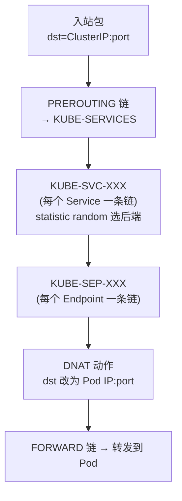

**特点**：每个 Service 生成一条 `KUBE-SVC-*` 链(用 `--probability` 做随机选择),每个 Endpoint 生成一条 `KUBE-SEP-*` 链(执行 DNAT)。规则总数 = Services × Endpoints,**线性膨胀**。

ClusterIP **不绑定任何网卡**——它只是 iptables 规则里的"逻辑地址",所以 ping ClusterIP 不通(内核找不到本地路由)。

### 4.3 IPVS 模式数据流

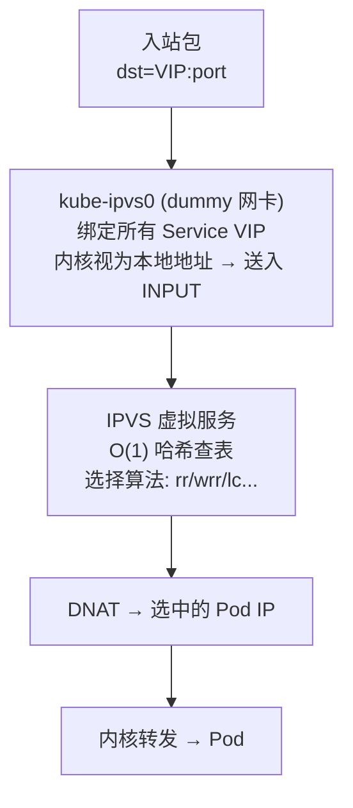

**关键：`kube-ipvs0` 网卡**

- **类型**：dummy（`ip -d link show kube-ipvs0` 显示 `<BROADCAST,NOARP> state DOWN`）
- **作用**：IPVS 要求虚拟服务的 VIP **必须绑到本地某网卡**,内核才会把 dst=VIP 的包送入 INPUT 链让 IPVS 拦截。dummy 网卡是最轻量的"占位符"。
- **上面的 IP**：所有 ClusterIP + LoadBalancer IP + ExternalIP(每个节点都有)
- **是否响应 ARP**：`NOARP` 标志 → **不主动响应 ARP**。但注意：`arp_ignore=0`(默认) 时,真实网卡(ens192)会**替** kube-ipvs0 上的 IP 应答 ARP → 导致 MetalLB 多节点抢答。所以 IPVS + MetalLB 必须 `arp_ignore=1`。

> ⚠️ IPVS 模式下能否 ping 通 VIP？答案是**取决于 kube-ipvs0 的状态和 arp_ignore 配置**：
> - 理论上：VIP 绑到 kube-ipvs0 是"本地地址",内核可回 ICMP(绕过 IPVS,IPVS 只处理 TCP/UDP)
> - 但实测(本套集群)：kube-ipvs0 状态 `DOWN` + `arp_ignore=1` → 外部 ARP 由 MetalLB 应答、包到了节点,但内核对 DOWN 状态接口上的地址**不回 ICMP** → ping 不通
> - 本机 ping 自己的 VIP：同样不通(dummy DOWN 接口行为)
>
> **结论**：生产环境 ping VIP 不通是正常现象,用 `curl VIP:port` 验证才对。

### 4.4 查看 / 修改 kube-proxy 模式

#### 方式 A：依赖本套脚本(部署时指定)

```yaml
# 04-init-master1.sh 生成的 kubeadm-config.yaml
apiVersion: kubeproxy.config.k8s.io/v1alpha1
kind: KubeProxyConfiguration
mode: ipvs          # ← 改这里：iptables / ipvs / nftables(1.29+)
```

最终落地：ConfigMap `kube-proxy`(存 etcd,节点上无文件)。

#### 方式 B：不依赖脚本,直接改运行中集群

```bash
# 查看当前模式
kubectl -n kube-system get cm kube-proxy -o yaml | grep "mode:"
# 或更直接(在节点上)
curl -s http://localhost:10249/proxyMode

# 修改
kubectl edit cm kube-proxy -n kube-system
# 把 mode: "" 或 mode: "iptables" 改成 mode: "ipvs"

# 生效（滚动重启 kube-proxy DaemonSet）
kubectl rollout restart ds kube-proxy -n kube-system

# 验证
# IPVS 模式：
ipvsadm -Ln | head -20
# iptables 模式：
iptables -t nat -L KUBE-SERVICES | head -20
```

> **参考**：[kube-proxy 配置](https://kubernetes.io/docs/reference/command-line-tools-reference/kube-proxy/)

### 4.5 修改模式的风险与排错

| 切换 | 风险 | 规避 |
|------|------|------|
| iptables → ipvs | 需所有节点已加载 `ip_vs/ip_vs_rr/ip_vs_wrr/ip_vs_sh/nf_conntrack` + 装 `ipset`;缺模块**静默回退** iptables | 切前 `lsmod \| grep ip_vs` 确认;切后 `ipvsadm -Ln` 确认有规则 |
| ipvs → iptables | 残留的 kube-ipvs0 网卡和 IPVS 规则可能干扰 | 切前 `ipvsadm --clear` + `ip link del kube-ipvs0` |
| 任何切换 | 切换期间 Service 转发**短暂中断**(Pod 滚动重启) | 业务低峰操作;有状态连接会断 |
| ipvs + MetalLB/LB | 必须 `arp_ignore=1 / arp_announce=2` | 本套 01-system-init.sh 已处理;手动部署需自行加 |

### 自测问题

1. kube-ipvs0 上挂了很多 IP,能删吗？（提示：那是 IPVS 的工作方式,删了 Service 就不转了）
2. 从 iptables 切到 ipvs 后 `ipvsadm -Ln` 是空的,为什么？（提示：检查 ip_vs 模块是否加载,kube-proxy 可能静默回退了）
3. MetalLB + IPVS 时所有节点都响应 VIP 的 ARP,为什么？（提示：arp_ignore=0 时 ens192 替 kube-ipvs0 应答）

---

## 第五章 Pod 间通信：同主机 vs 跨主机

> 读完本章你能做到：画出同主机 Pod 通信和跨主机 Pod 通信的数据路径，说出 veth pair、cni0 桥、路由表各自的角色。

### 5.1 核心概念

每个 Pod 运行在独立的 **Linux 网络命名空间**（Network Namespace）里——有自己的网卡(eth0)、路由表、ARP 表。Pod 通过 **veth pair**（一对虚拟网线,一头在 Pod 里叫 eth0,一头在宿主机）连接到宿主网络。

> **veth pair** 类比：Pod 里的 eth0 和宿主机上的 vethXXX 就像一根网线的两头——从一头塞进去的包,另一头一定能收到。

### 5.2 同主机 Pod 通信（纯 L2 桥接,最快路径）

同一节点上的两个 Pod 通信,**不出节点、不走物理网卡、不经路由**——纯 L2 交换,延迟最低。

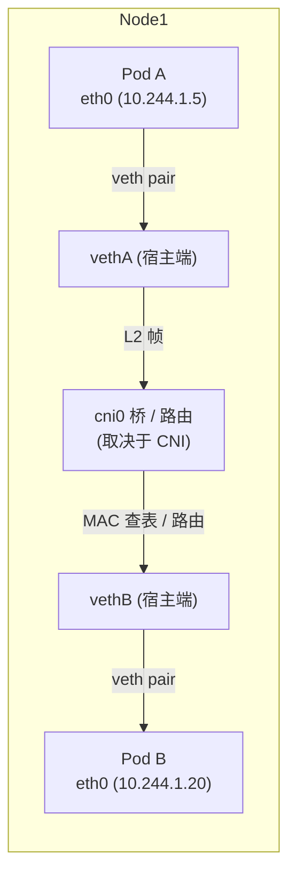

**Flannel 同主机**：Pod A eth0 → veth → **cni0 桥**(Linux Bridge,MAC 查表转发) → veth → Pod B。纯二层交换。

**Calico 同主机**：Pod A eth0 → **caliXXX**(veth) → 宿主**路由表**(/32 直连路由) → **caliYYY**(veth) → Pod B。**Calico 不用桥,用纯路由**——每个 Pod 一条 /32 主机路由,配合 proxy ARP(169.254.1.1 网关)实现。

**Cilium 同主机**：Pod A eth0 → **lxcXXX**(veth) → **eBPF 程序**(TC hook,`bpf_redirect_peer()` 直接重定向到目标 veth) → **lxcYYY** → Pod B。**不经桥、不经 iptables、不经内核路由栈**——eBPF 在内核态最短路径转发。

> **参考**：[Kubernetes Networking Model](https://kubernetes.io/docs/concepts/cluster-administration/networking/) | [Calico FAQ: Why /32 routes](https://docs.tigera.io/calico/latest/reference/faq)

### 5.3 跨主机 Pod 通信（需 CNI 封装/路由）

不同节点上的 Pod 通信必须经过物理网络。CNI 插件的核心任务就是**让跨节点的 Pod 觉得自己在同一个扁平网络里**（K8s 三大原则之一）。

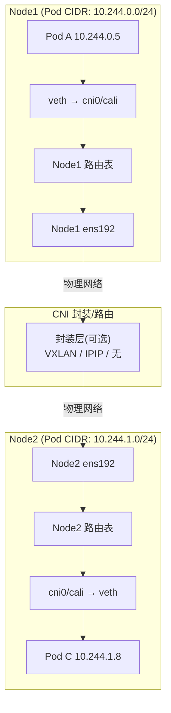

跨主机这一步,三种 CNI 的差异就体现出来了——往下看第六章。

---

## 第六章 CNI 网络插件对比：Flannel / Calico / Cilium

> 读完本章你能做到：说出三种 CNI 各自有哪些模式、每种模式创建哪些虚拟网卡、跨主机流量怎么走、用什么端口。

### 6.1 三种插件定位

| 维度 | Flannel | Calico | Cilium |
|------|---------|--------|--------|
| **定位** | 最简单的覆盖网络 | 生产标准(灵活多模式) | eBPF 原生高性能 |
| **NetworkPolicy** | ❌ 不支持 | ✅ L3/L4 | ✅ L3/L4/**L7+DNS** |
| **kube-proxy 替代** | ❌ | 可选(eBPF) | ✅ 完全替代 |
| **最低内核** | 任意 | 4.x+ | **5.10+** 推荐 |
| **适用** | 开发/测试/学习 | 任意规模生产 | 现代高性能集群 |

> **参考**：[Flannel backends](https://github.com/flannel-io/flannel/blob/master/Documentation/backends.md) | [Calico 网络](https://docs.tigera.io/calico/latest/networking/) | [Cilium 文档](https://docs.cilium.io/en/stable/)

### 6.2 Flannel 模式与流量路径

```mermaid
flowchart TD
    subgraph "Flannel 两种模式"
        FV["VXLAN (默认)<br/>UDP 封装,跨子网可用"]
        FH["host-gw<br/>纯路由,需 L2 相邻"]
    end
```

| 模式 | 虚拟网卡 | 跨主机流量路径 | 端口/MTU |
|------|---------|--------------|---------|
| **VXLAN** | `cni0`(桥) + `flannel.1`(VTEP, 即 VXLAN Tunnel Endpoint——负责把包封装成 UDP 发到对端) + `veth*` | Pod → veth → cni0 → 路由 → **flannel.1**(VXLAN 封装) → ens192 → 网络 → ens192 → flannel.1(解封) → cni0 → veth → Pod | **UDP 8472**(Linux 默认,非 IANA 4789) / MTU 1450 |
| **host-gw** | `cni0`(桥) + `veth*`(无 tunnel) | Pod → veth → cni0 → 路由(下一跳=对端节点 IP) → ens192 → **直接路由,无封装** → ens192 → cni0 → veth → Pod | 无封装 / MTU 1500 |

> ⚠️ **Flannel VXLAN 端口修正**：Linux 内核历史默认 UDP 8472(非 IANA 标准 4789)。[内核源码注释](https://github.com/torvalds/linux/blob/master/drivers/net/vxlan/vxlan_core.c):"The IANA assigned port is 4789, but the Linux default is 8472 for compatibility."

**host-gw 限制**：所有节点必须 **L2 相邻**(同一广播域/子网)——因为下一跳 IP 需 ARP 解析 MAC,ARP 广播无法跨路由器。

### 6.3 Calico 模式与流量路径

```mermaid
flowchart TD
    subgraph "Calico 四种模式"
        CB["BGP 原生路由<br/>Bird/confd 交换路由<br/>无封装,性能最优"]
        CI["IPIP<br/>IP-in-IP 封装<br/>tunl0 接口"]
        CV["VXLAN<br/>UDP 封装<br/>不跑 BGP"]
        CE["eBPF<br/>替代 iptables+kube-proxy"]
    end
```

| 模式 | 虚拟网卡 | 跨主机流量路径 | 端口/MTU |
|------|---------|--------------|---------|
| **BGP** | `caliXXX`(veth) | Pod → caliXXX → 路由(BGP 学到,下一跳=对端节点) → ens192 → **直接路由,无封装** → ens192 → 路由 → caliYYY → Pod | 无封装 / MTU 1500 |
| **IPIP** | `caliXXX` + `tunl0`(IP-in-IP) | Pod → caliXXX → 路由 → **tunl0**(IP-in-IP 封装,proto 4) → ens192 → 网络 → ens192 → tunl0(解封) → 路由 → caliYYY → Pod | 无端口(IP 协议 4) / MTU **1480** |
| **VXLAN** | `caliXXX` + `vxlan.calico`(VTEP) | Pod → caliXXX → 路由 → **vxlan.calico**(VXLAN 封装) → ens192 → 网络 → ens192 → vxlan.calico(解封) → 路由 → caliYYY → Pod | **UDP 4789**(IANA 标准) / MTU 1450 |
| **eBPF** | `caliXXX` | 路径同上,但 **eBPF 替代 iptables** 做策略和 Service 转发 | 同上 |

**ipipMode 选项**：`Always`(所有跨节点都封装) / `CrossSubnet`(仅跨子网封装,同子网直接路由) / `Never`(禁用)。CrossSubnet 是生产推荐——同子网零开销,跨子网才封装。

**为什么 Calico 不用桥(cni0)而用 /32 路由？** [官方 FAQ](https://docs.tigera.io/calico/latest/reference/faq) 解释：
1. 设计哲学是"纯 L3 路由网络"——每个 Pod 视为独立 L3 端点
2. caliXXX 启用 `proxy_arp`,Pod 网关设为 `169.254.1.1`(link-local),caliXXX 代答 ARP
3. 所有 caliXXX 共享 MAC `ee:ee:ee:ee:ee:ee`
4. 避免 L2 广播风暴,无广播域限制
5. 路由优于桥的**隔离性**——每个包都经过路由决策,可精细控制(NetworkPolicy)

#### 三种 CNI 的"虚拟 ARP 响应"机制对比

Calico 的 proxy ARP 是它"纯 L3 路由"设计的关键——但 Flannel 和 Cilium 有类似机制吗？

```mermaid
flowchart LR
    subgraph "Calico: Proxy ARP"
        CP["Pod 问: 谁是 169.254.1.1?"]
        CV["caliXXX (proxy_arp=1)<br/>代答: 我是!"]
        CR["Pod 所有包 → caliXXX<br/>→ 宿主路由表"]
    end

    subgraph "Flannel: 真实网关"
        FP["Pod 问: 谁是 10.244.1.1?"]
        FB["cni0 桥 (真实持有该 IP)<br/>自己回答: 我是!"]
        FR["Pod 包 → cni0 桥<br/>→ L2 交换/路由"]
    end

    subgraph "Cilium: eBPF 绕过"
        LP["Pod 发包"]
        LE["lxcXXX TC hook<br/>eBPF 直接接管<br/>(不走传统 ARP 路径)"]
        LR["eBPF bpf_redirect_peer()<br/>内核态直接转发"]
    end
```

| CNI | 有虚拟 ARP 响应吗 | 怎么实现 | 为什么需要/不需要 |
|-----|:---:|------|------|
| **Calico** | ✅ 有(proxy ARP) | 每个 `caliXXX` 宿主端启用 `proxy_arp=1`。Pod 网关设为 `169.254.1.1`(link-local,实际不存在任何网卡上)。caliXXX 代替回答"我是 169.254.1.1",把自己 MAC 返回给 Pod | **不用桥就没有真实网关可应答 ARP**。用 proxy ARP "骗" Pod 把所有出站包交给 caliXXX → 进入宿主路由表(/32 精确路由) |
| **Flannel** | ❌ 不需要 | Pod 网关是 `cni0` 桥的**真实 IP**(如 `10.244.1.1`)。Pod 发 ARP 问网关时,cni0 **自己真实应答**——因为它确实持有这个 IP | **用桥就有真实网关**——不需要虚拟应答,ARP 走正常流程 |
| **Cilium** | ⚠️ 类似但机制不同 | 不依赖传统 proxy ARP。eBPF 程序(挂在 `lxcXXX` 的 TC hook)在**内核态直接接管包**,用 `bpf_redirect_peer()` 重定向——**绕过了传统 ARP→路由表的整个路径**。某些配置下会设 proxy ARP 做兜底,但核心转发不走 ARP | **eBPF 替代了整个传统网络栈路径**——包到 lxcXXX 就被 eBPF 接管,ARP 解析本身被绕过,不需要虚拟应答 |

> **核心洞察**：这三种方式体现了三代网络设计思想:
> - **Flannel**（第一代）：传统桥+真实网关——简单但有 L2 广播域限制
> - **Calico**（第二代）：proxy ARP + 纯 L3 路由——打破 L2 限制,每包经路由可精细控制
> - **Cilium**（第三代）：eBPF 绕过整个传统栈——最高性能,但需高版本内核(5.10+)

**VXLAN 模式不跑 BGP**：[Issue #10337](https://github.com/projectcalico/calico/issues/10337) 明确说明"If you use only VXLAN pools, BGP networking is not required."——VXLAN 封装替代了 BGP 路由通告。

### 6.4 Cilium 模式与流量路径

```mermaid
flowchart TD
    subgraph "Cilium 三种模式"
        CD["Direct Routing (tunnel=disabled)<br/>eBPF 直接路由<br/>性能最优"]
        CTun["VXLAN (tunnel=vxlan)<br/>eBPF + VXLAN overlay"]
        CG["Geneve (tunnel=geneve)<br/>类似 VXLAN"]
    end
```

| 模式 | 虚拟网卡 | 跨主机流量路径 | 端口/MTU |
|------|---------|--------------|---------|
| **Direct Routing** | `lxcXXX` + `cilium_host`/`cilium_net` | Pod → lxcXXX → **eBPF(TC hook)路由决策** → ens192 → **直接路由**(需底层网络支持 Pod CIDR 路由) → ens192 → eBPF → lxcYYY → Pod | 无封装 / MTU 1500 |
| **VXLAN** | `lxcXXX` + `cilium_vxlan`(VTEP) | Pod → lxcXXX → eBPF → **cilium_vxlan**(封装) → ens192 → 网络 → ens192 → cilium_vxlan(解封) → eBPF → lxcYYY → Pod | **UDP 8472** / MTU 1450 |

**eBPF 加速点**：
- **XDP**(网卡驱动层,sk_buff 分配前)：Service LB/DNAT,O(1) hash map 查找
- **TC**(ingress/egress hook)：NetworkPolicy 执行,读取 pod identity
- **cgroup/socket**：socket connect 时标记 pod identity
- **kube-proxy 替代**：`kubeProxyReplacement=true` → 无 iptables KUBE-SVC 规则,支持 DSR/Maglev

> 完全绕过 iptables 条件：`kubeProxyReplacement=true` + `bpf.masquerade=true` + `bpf.hostLegacyRouting=false` → **零 conntrack 开销**。

### 6.5 虚拟网卡速查表

| 网卡名 | 属于 | 作用 | 何时存在 |
|--------|------|------|---------|
| `cni0` | Flannel | Linux Bridge,同主机 Pod L2 交换 | Flannel 所有模式 |
| `flannel.1` | Flannel | VXLAN VTEP,跨主机封装/解封 | VXLAN 模式 |
| `veth*` | 通用 | Pod 命名空间到宿主的虚拟网线 | 所有 CNI |
| `caliXXXXXXXX` | Calico | veth 宿主端,配合 /32 路由 | Calico 所有模式 |
| `tunl0` | Calico | IP-in-IP tunnel endpoint | IPIP 模式 |
| `vxlan.calico` | Calico | VXLAN VTEP | VXLAN 模式 |
| `lxcXXXX` | Cilium | veth 宿主端,eBPF 程序挂载点 | Cilium 所有模式 |
| `cilium_host`/`cilium_net` | Cilium | 管理接口 | Cilium 所有模式 |
| `cilium_vxlan` | Cilium | VXLAN VTEP | tunnel=vxlan |
| `kube-ipvs0` | kube-proxy | dummy,挂 Service VIP | IPVS 模式 |

### 6.6 集群规模扩展性：每种 CNI 最多支持多少节点？

> 读完本段你能回答：Flannel/Calico/Cilium 各自能撑多大规模、瓶颈在哪、怎么突破。

```mermaid
flowchart LR
    subgraph "节点规模上限"
        F["Flannel<br/>~100-200 节点<br/>(实践瓶颈)"]
        C["Calico<br/>数千节点(单层 RR)<br/>10 万+(层级 RR)"]
        L["Cilium<br/>~5000(默认)<br/>~64000(调优后,IPv4)"]
    end
    F -->|"10x"| C -->|"10x"| L
```

| CNI | 实践节点上限 | 理论/硬性上限 | 瓶颈所在 | 突破方法 |
|-----|:---:|:---:|------|------|
| **Flannel** | **~100-200** | 无硬限制 | VXLAN 覆盖网络性能退化(15-20% 开销) + 无路由优化 + 无 NetworkPolicy 引擎 | 无法突破——换 Calico/Cilium |
| **Calico** | **数千**(单层 RR) | **10 万+**(层级 RR) | BGP 全网格 O(n²) 连接数 | Route Reflector 层级化 |
| **Cilium** | **~5000**(默认 BPF map) | **~64,000**(IPv4) / ~32,000(双栈) | eBPF map 条目容量(Tunnel map 64k) | 调大 BPF map + 增加 agent 内存 |

#### Flannel 为什么撑不住大规模？

Flannel 没有"硬性节点上限",但 **200 节点以上实践中性能明显退化**,原因:

1. **VXLAN 封装开销 15-20%**——每个跨节点包都要封/解,CPU 消耗随节点数线性增长
2. **无路由优化**——flanneld 守护进程用 etcd watch 同步路由信息,节点多时 etcd watch 压力大
3. **无 NetworkPolicy**——无法做细粒度隔离,广播域内所有 Pod 互通,安全隐患随规模放大
4. **单一 VTEP**——flannel.1 是所有跨节点流量的出口,成为单节点带宽瓶颈

> 官方定位也是"simple overlay for small clusters"。超过 100 节点建议迁移。[Flannel GitHub](https://github.com/flannel-io/flannel)

##### Flannel 的 SubnetLen 与节点数/Pod 数

Flannel 也有类似 Calico blockSize 的概念——**`SubnetLen`**,控制每个节点分到多大的 IP 子网:

| 参数 | 默认值 | 配置位置 |
|------|:---:|------|
| `SubnetLen` | **24**(/24 = 254 IP/节点) | `/etc/kube-flannel/net-conf.json` |

```json
{
  "Network": "10.244.0.0/16",
  "SubnetLen": 24,
  "Backend": { "Type": "vxlan" }
}
```

**Flannel 的节点数 = Pod CIDR ÷ SubnetLen**:

| Pod CIDR | SubnetLen | 每节点 IP | 最大节点数 | 每节点最大 Pod |
|----------|:---------:|:---:|:---:|:---:|
| 10.244.0.0/**16** | /24 (默认) | 254 | **256** | 254(受 kubelet 110 限制,见下) |
| 10.0.0.0/**8** | /24 (默认) | 254 | **65,536** | 254 |
| 10.244.0.0/16 | /20 | 4094 | **16** | 4094 |

> ⚠️ Flannel 默认 `/16` + SubnetLen `/24` = **只有 256 个节点**——比 Calico 的 1024 还少！要支持更多节点,需加大 Pod CIDR(如 `/8`)或缩小 SubnetLen。[Flannel configuration.md](https://github.com/flannel-io/flannel/blob/master/Documentation/configuration.md)

> ⚠️ **修改 SubnetLen 时必须同步改 kube-controller-manager 的 `--node-cidr-mask-size`**,两者必须一致,否则 Pod IP 分配会出错。

##### kubelet `--max-pods=110` 与 CNI 子网的关系

K8s 每节点默认最多 110 个 Pod——**这不是 CNI 的限制,是 kubelet 的 `--max-pods` 参数**(默认 110)。但两者取**较小值**生效:

```text
实际每节点最大 Pod 数 = min(kubelet --max-pods, CNI 子网可分配 IP 数)
```

| CNI | 子网默认大小 | 可分配 IP | kubelet 默认 110 | **实际瓶颈** |
|-----|:---------:|:---:|:---:|------|
| **Calico** | /26 = 64 | ~60(减保留) | 110 | **CNI 先到**(60<110) |
| **Flannel** | /24 = 254 | ~252 | 110 | **kubelet 先到**(110<252) |
| **Cilium** | /24 = 254 | ~252 | 110 | **kubelet 先到** |

**结论**：Calico 默认 blockSize=/26 是最常见的"Pod 跑不到 110 个"的原因——每节点只有 64 个 IP,实际只能跑 ~60 个 Pod。要跑满 110 必须改 blockSize 到 /25(128 IP)或更大。

> **参考**：kubelet `--max-pods=110` 来源 [K8s Large Clusters](https://kubernetes.io/docs/setup/best-practices/cluster-large/)——官方推荐单节点 ≤110 Pod、集群 ≤5000 节点、总 Pod ≤150,000。

#### Calico 怎么支撑数千甚至十万节点？

Calico 的扩展性受**三重约束**（按优先级）：

```mermaid
flowchart TD
    A["Calico 节点数量上限"] --> B["① Pod CIDR ÷ blockSize<br/>= IP 块数 = 最大节点数<br/>(最直接的硬限制)"]
    A --> C["② BGP 全网格 O(n²)<br/>~200 节点需 Route Reflector"]
    A --> D["③ etcd/datastore 压力<br/>每节点有路由条目"]
```

##### 第一重约束：blockSize（子网掩码）决定最大节点数

Calico 的 IPAM 把 Pod CIDR 切成固定大小的 **block**（IP 块），**每个节点分配一个或多个 block**。默认 `blockSize=/26`（64 个 IP/块）：

```text
你的集群：Pod CIDR = 10.244.0.0/16 = 65,536 个 IP
默认 blockSize = /26 = 每块 64 个 IP

最大节点数 = 65,536 ÷ 64 = 1,024 个节点
```

| Pod CIDR | blockSize | 每块 IP 数 | 最大节点数 | 适用场景 |
|----------|:---------:|:---:|:---:|------|
| /16 (65,536) | **/26 (默认)** | 64 | **1,024** | 中等集群(本套) |
| /16 | /24 | 256 | **256** | 每节点 Pod 多(AI/大数据) |
| /16 | /28 | 16 | **4,096** | 大规模集群、每节点 Pod 少 |
| /12 (1,048,576) | /26 | 64 | **16,384** | 超大规模 |
| /12 | /28 | 16 | **65,536** | 极大规模 |

> ⚠️ **blockSize 一旦 IPPool 创建就不可修改**（Calico 官方限制：`cidr` 和 `blockSize` 字段 immutable）。要改只能新建 Pool → 禁旧 → 迁移 → 删旧。**必须在部署前想清楚。**

**部署时在哪指定 blockSize？**

```yaml
# calico.yaml 里的 IPPool（07-install-calico.sh apply 的 manifest）
apiVersion: projectcalico.org/v3
kind: IPPool
metadata:
  name: default-ipv4-ippool
spec:
  cidr: 10.244.0.0/16
  blockSize: 26          # ← 这里改（默认 26）
  ipipMode: Never
  vxlanMode: Always
  natOutgoing: true
```

不依赖脚本直接改（已有集群,需迁移）:
```bash
# ⚠️ blockSize 不可原地改！正确做法：新建 Pool → 禁旧 → 滚动重启 → 删旧
kubectl apply -f new-pool.yaml          # blockSize: 28
kubectl patch ippool default-ipv4-ippool --type merge -p '{"spec":{"disabled":true}}'
kubectl rollout restart deploy --all -A  # Pod 获取新池 IP
kubectl delete ippool default-ipv4-ippool
```

> **参考**：[Calico IPAM 配置](https://docs.tigera.io/calico/latest/networking/ipam/) | [IPPool 资源](https://docs.tigera.io/calico/latest/reference/resources/ippool)

##### 第二重约束：BGP 全网格 O(n²) → Route Reflector 突破

Calico 的扩展性取决于 **BGP 拓扑设计**:

**默认全网格(full mesh)**——每个节点和其他所有节点建 BGP 连接:
- 100 节点 = 4,950 条连接
- 500 节点 = 124,750 条连接
- **~200 节点是全网格的实践上限**(O(n²) 连接数不可持续)

**Route Reflector(RR)突破瓶颈**——节点只和少数 RR 对等,RR 之间交换路由:

| 规模 | RR 数量 | 拓扑 | 连接数 |
|------|:---:|------|:---:|
| 100-200 节点 | 2-3 | 跨 AZ | ~600 |
| 200-500 节点 | 3-5 | 跨 AZ | ~2,500 |
| 500-5000 节点 | 5-7 | 层级化 | ~35,000 |
| 5000+ 节点 | 层级 RR | 机架级→集群级→全局级 | 线性增长 |

> Calico 官方文档描述了"100 个 RR 全网格支撑 10 万节点"的拓扑设计——类似互联网 BGP 的层级路由架构。[Tigera: Route Reflection](https://www.tigera.io/blog/how-does-in-cluster-route-reflection-work/)

#### Cilium 的 eBPF map 容量限制

Cilium 的硬性上限来自**内核 eBPF map 的最大条目数**:

| BPF Map | 默认上限 | 决定什么 |
|---------|:---:|------|
| **Tunnel Map** | 64k 条目 | 最大 **~64,000 节点**(IPv4) 或 ~32,000(双栈) |
| IP Cache | 512k 条目 | 最大 512k endpoints |
| CT(连接跟踪) | 512k TCP / 256k UDP | 单节点最大并发连接 |
| Identity | 建议 <10,000 | 唯一 label 组合数 |

**~5000 节点是需要开始调优的阈值**:

| 规模 | 需要做什么 |
|------|-----------|
| <100 节点 | 默认配置即可 |
| 100-500 节点 | BPF map 2× 默认,agent 内存 1Gi |
| 500-5000 节点 | BPF map 4× 默认,agent 内存 2Gi,label 优化(减少 identity 数) |
| 5000+ 节点 | 调大 `--bpf-ct-global-tcp-max` 等参数,或用 `--bpf-map-dynamic-size-ratio` 按内存自动调 |

> **参考**：[Cilium eBPF Maps 文档](https://docs.cilium.io/en/stable/network/ebpf/maps/) | [Tuning Cilium for Scale](https://oneuptime.com/blog/post/2026-03-14-tune-cilium-performance-and-scalability/view)

### 6.7 CNI 选型决策树

```mermaid
flowchart TD
    Start["选 CNI"] --> Q1{"需要 NetworkPolicy?"}
    Q1 -->|"不需要"| Flannel["Flannel VXLAN<br/>最简单,开箱即用"]
    Q1 -->|"需要"| Q2{"内核 >= 5.10?<br/>团队懂 eBPF?"}
    Q2 -->|"是"| Cilium["Cilium<br/>eBPF 原生,L7 策略<br/>可替代 kube-proxy"]
    Q2 -->|"否"| Q3{"需要 BGP/大规模?"}
    Q3 -->|"是"| CalicoBGP["Calico BGP<br/>成熟稳定,企业首选"]
    Q3 -->|"否"| CalicoVXLAN["Calico VXLAN<br/>兼容性最好<br/>(本套方案使用)"]
```

### 自测问题

1. Flannel VXLAN 和 Calico VXLAN 都用 VXLAN 封装,它们的 UDP 端口相同吗？（提示：一个 8472,一个 4789）
2. Calico 同主机 Pod 通信经过 tunl0 吗？（提示：不经过,tunl0 仅用于跨主机 IPIP 封装）
3. Cilium 为什么能绕过 iptables？（提示：eBPF 程序直接在内核态 TC/XDP hook 点处理,不走 netfilter 链）
4. 你的集群 Pod CIDR 是 10.244.0.0/16、Calico blockSize=/26,最多支持多少节点？每节点最多多少 Pod？（提示：1024 节点、~60 Pod）
5. kubelet 默认 max-pods=110,为什么 Calico 默认每节点只能跑 ~60 个？（提示：blockSize /26 只有 64 个 IP）

---

### 6.8 Cilium 核心概念详解

> Cilium 的架构与 Flannel/Calico 有本质差异——它用 **eBPF 程序替代了传统网络栈**(iptables/路由表/bridge)。理解以下核心概念是用好 Cilium 的前提。

#### Identity（身份）

Cilium 给每组**相同安全标签(label)**的 Pod 分配一个唯一的数字 **Identity**（不是按 Pod IP 区分,而是按 label 组合）。NetworkPolicy 的匹配基于 Identity 而非 IP → 规则数不随 Pod 数增长。

```yaml
# 例：所有带 app=frontend + env=prod 的 Pod 共享同一个 Identity
# Identity 存在 eBPF map 里，查找 O(1)
```

> 建议 Identity 总数 <10,000。每个唯一 label 组合 = 一个 Identity。可通过 `--labels` 限制参与身份计算的 label 来控制增长。

#### Endpoint

每个 Pod 在 Cilium 看来是一个 **Endpoint**——有 IP、有 Identity、有关联的 eBPF 策略程序。Cilium agent 为每个 Endpoint 编译并加载专属的 eBPF 程序到其 lxcXXX veth 的 TC hook 上。

#### eBPF 数据面架构

```mermaid
flowchart TD
    subgraph "Cilium eBPF 数据面"
        Pod["Pod (Endpoint)"]
        LXC["lxcXXX veth<br/>TC hook: cil_from_container"]
        BPF["eBPF 程序<br/>① Identity 查找(ipcache map)<br/>② Policy 匹配(policy map)<br/>③ Service LB(lb4_services map)<br/>④ CT 连接跟踪(ct map)"]
        OUT["路由决策<br/>同主机: bpf_redirect_peer<br/>跨主机: cilium_vxlan 或直接路由"]
    end

    Pod --> LXC --> BPF --> OUT
```

#### Cilium IPAM（每节点 IP 分配）

Cilium 的 IPAM 默认使用 **cluster-pool 模式**——和 Calico blockSize / Flannel SubnetLen 类似,按 mask-size 给每节点分配 IP 子网:

| 参数 | 默认值 | 配置方式 |
|------|:---:|------|
| `--cluster-pool-ipv4-mask-size` | **24**(/24 = 254 IP/节点) | Helm: `ipam.operator.clusterPoolIPv4MaskSize` |
| `--cluster-pool-ipv4-cidr` | `10.0.0.0/8` | Helm: `ipam.operator.clusterPoolIPv4PodCIDRList` |

**但 Cilium 的节点数上限不由 CIDR 切分决定**——而是由 eBPF Tunnel map(64k 条目)决定。所以即使 CIDR 用完了可以加新的 CIDR 段,节点上限仍是 ~64,000(IPv4)。

#### Cilium 关键配置参数作用说明

| 配置(Helm value) | 作用 | 为什么要配 | 不配/默认会怎样 |
|------|------|-----------|---------------|
| `kubeProxyReplacement=true` | 用 eBPF **完全替代 kube-proxy** 做 Service DNAT/LB | 消除 iptables/IPVS 规则链开销,Service 查找 O(1) hash map | 默认 false,仍依赖 kube-proxy(iptables/IPVS)——两套转发引擎并存浪费资源 |
| `routingMode=native` (或 `tunnel=disabled`) | eBPF 直接路由,**不走 VXLAN 封装** | 零封装开销,性能接近裸机(MTU 1500) | 默认 `tunnel=vxlan`,跨节点包多 50 字节封装,MTU 降到 1450 |
| `bpf.masquerade=true` | eBPF 做 SNAT(替代 iptables MASQUERADE 链) | 绕过 netfilter 的 MASQUERADE 规则,减少 conntrack 压力 | 默认 false,SNAT 仍走 iptables → 包仍经过 netfilter 链 |
| `bpf.hostLegacyRouting=false` | **完全绕过内核路由栈**——eBPF 直接做路由决策 | 避免包经过 FIB 查找 + netfilter 链,最大化加速 | 默认 true,eBPF 处理完仍丢回内核路由栈(加速效果打折) |
| `loadBalancer.acceleration=native` | 启用 **XDP 层加速** Service LB | XDP 在网卡驱动层(sk_buff 分配前)做 DNAT,延迟最低 | 默认无 XDP,Service 查找在 TC 层(sk_buff 分配后,稍慢) |
| `ipam.operator.clusterPoolIPv4MaskSize=24` | 每节点分配 /24 子网(254 Pod IP) | 控制每节点 Pod 密度 vs 可支持节点总数的平衡 | 默认 /24;改小(如 /25=128)Pod 少但节点数翻倍;改大(如 /23=512)Pod 多但节点数减半 |
| `hubble.enabled=true` | 启用 **Hubble** 流量观测(per-flow 可视化) | 提供 L3-L7 流量图、丢包原因、延迟直方图——排障利器 | 默认 false,无观测能力,排障只能靠 tcpdump |

> ⚠️ **完全绕过 iptables 的条件**：`kubeProxyReplacement=true` + `bpf.masquerade=true` + `bpf.hostLegacyRouting=false` **三个都要开**。少开一个 → 包仍部分走 netfilter → 加速不彻底。

> **参考**：[Cilium IPAM](https://docs.cilium.io/en/stable/network/concepts/ipam/) | [eBPF Maps](https://docs.cilium.io/en/stable/network/ebpf/maps/) | [kube-proxy Replacement](https://docs.cilium.io/en/stable/network/kubernetes/kubeproxy-free/)

---

### 6.9 Calico Route Reflector 配置示例

> 当集群超过 ~100 节点时,BGP 全网格不再可持续,需要引入 Route Reflector(RR)。以下是生产级 RR 配置示例，**每步都解释作用和不做的后果**。

#### 第一步：选定 RR 节点并打 label

```bash
kubectl label node master1 route-reflector=true
kubectl label node master2 route-reflector=true
kubectl label node master3 route-reflector=true
```

| 作用 | 为什么要做 | 不做会怎样 |
|------|-----------|-----------|
| 给 3 个稳定节点打上 `route-reflector=true` 标签 | 后续的 BGPPeer 资源用 `nodeSelector/peerSelector` 按这个标签选择谁是 RR、谁和 RR 对等 | BGPPeer 规则无法匹配到 RR 节点,路由分发不生效 |

> 选什么节点当 RR：选**稳定、不会频繁重启**的节点(通常 master 或专用 infra 节点)。RR 挂了 = 路由中断,所以至少选 3 个跨可用区做冗余。

#### 第二步：配置 BGPPeer——普通节点只和 RR 对等

```yaml
apiVersion: projectcalico.org/v3
kind: BGPPeer
metadata:
  name: peer-to-rr
spec:
  nodeSelector: "!route-reflector == 'true'"   # 选谁执行：所有"非 RR"节点
  peerSelector: "route-reflector == 'true'"    # 和谁对等：所有 RR 节点
```

| 字段 | 含义 | 作用 |
|------|------|------|
| `nodeSelector` | 这条规则在哪些节点生效 | `!route-reflector == 'true'` = "我不是 RR 的节点"都执行 |
| `peerSelector` | 这些节点和谁建 BGP 连接 | `route-reflector == 'true'` = "和所有 RR 节点建连接" |

**效果**：每个普通节点只和 3 个 RR 建 BGP 连接(3 条),不再和其他所有节点建(O(n²) → O(n))。

**不做会怎样**：普通节点仍和所有节点全网格对等,100+ 节点时 BGP 连接数爆炸、BIRD 内存/CPU 耗尽。

#### 第三步：RR 节点之间互相对等

```yaml
apiVersion: projectcalico.org/v3
kind: BGPPeer
metadata:
  name: rr-mesh
spec:
  nodeSelector: "route-reflector == 'true'"    # RR 自己
  peerSelector: "route-reflector == 'true'"    # 和其他 RR 对等
```

| 作用 | 为什么要做 | 不做会怎样 |
|------|-----------|-----------|
| 让 3 个 RR 之间建全网格(3 条连接) | RR 需要互相同步学到的路由,才能把完整路由表反射给各自的客户端节点 | RR 之间路由不同步,节点只能学到部分路由 → 跨节点 Pod 部分不通 |

> 3 个 RR 的全网格只有 3 条连接——可承受。如果 RR 数量上到 10+,可以引入二级 RR(层级化)。

#### 第四步：给 RR 节点设置 Cluster ID

```yaml
apiVersion: projectcalico.org/v3
kind: Node
metadata:
  name: master1
  labels:
    route-reflector: "true"
spec:
  bgp:
    routeReflectorClusterID: "224.0.0.1"   # 所有 RR 用相同 Cluster ID
```

| 字段 | 含义 | 作用 |
|------|------|------|
| `routeReflectorClusterID` | BGP Route Reflector 的集群标识 | 告诉 BIRD "我是 RR,要把收到的路由反射给客户端" |

**为什么所有 RR 用相同 Cluster ID**：同一 Cluster ID 的 RR 被视为一组冗余——它们互相交换路由但不反射(避免环路)。

**不做会怎样**：没有 Cluster ID 的节点不会执行"路由反射"行为——它只是普通 BGP 对等体,收到路由不会转发给其他客户端 → RR 形同虚设。

#### 第五步：禁用默认全网格

```yaml
apiVersion: projectcalico.org/v3
kind: BGPConfiguration
metadata:
  name: default
spec:
  nodeToNodeMeshEnabled: false   # ← 关闭全网格
  asNumber: 64512                # AS 号(所有节点同一 AS,iBGP)
```

| 字段 | 含义 | 作用 |
|------|------|------|
| `nodeToNodeMeshEnabled: false` | 关闭 Calico 默认的"每个节点和所有其他节点建 BGP 全网格" | 关闭后节点只按 BGPPeer 规则(第二步)连接 RR,不再两两互连 |
| `asNumber: 64512` | 全集群使用的 BGP 自治系统号 | 所有节点同一 AS = iBGP(内部 BGP),RR 才能工作 |

**不做会怎样(最关键)**：如果不关闭全网格,前面配的 BGPPeer 规则**叠加**在全网格之上——每个节点既和 RR 建连接,又和所有其他节点建连接 → 连接数不减反增,RR 白配了。

> ⚠️ **必须在第二步(BGPPeer)配好后再关全网格**,否则关了全网格但 BGPPeer 还没生效 → 短暂全部路由丢失 → Pod 跨节点不通。正确顺序：先加 BGPPeer → 确认 RR 连接建立 → 再关全网格。

> **参考**：[Tigera: Route Reflection](https://www.tigera.io/blog/how-does-in-cluster-route-reflection-work/) | [Calico BGP 配置](https://docs.tigera.io/calico/latest/networking/configuring/bgp)

---

### 6.10 NetworkPolicy 配置示例（Calico vs Cilium）

> NetworkPolicy 是 K8s 的**网络防火墙**——控制哪些 Pod 能和哪些 Pod 通信。Flannel 不支持,Calico 支持 L3/L4,Cilium 支持到 L7。

#### K8s 原生 NetworkPolicy（Calico/Cilium 都支持）

```yaml
# 只允许带 app=frontend 的 Pod 访问 app=backend 的 80 端口
apiVersion: networking.k8s.io/v1
kind: NetworkPolicy
metadata:
  name: allow-frontend-to-backend
  namespace: default
spec:
  podSelector:
    matchLabels:
      app: backend          # 对谁生效
  policyTypes: [Ingress]
  ingress:
  - from:
    - podSelector:
        matchLabels:
          app: frontend     # 只允许 frontend 来
    ports:
    - protocol: TCP
      port: 80              # 只允许 TCP 80
```

> **参考**：[K8s NetworkPolicy](https://kubernetes.io/docs/concepts/services-networking/network-policies/)

#### Cilium 扩展：CiliumNetworkPolicy（L7 + DNS 策略）

```yaml
# 只允许 frontend Pod 访问 backend 的 HTTP GET /api/*（L7 精确控制）
apiVersion: cilium.io/v2
kind: CiliumNetworkPolicy
metadata:
  name: l7-api-policy
spec:
  endpointSelector:
    matchLabels:
      app: backend
  ingress:
  - fromEndpoints:
    - matchLabels:
        app: frontend
    toPorts:
    - ports:
      - port: "80"
        protocol: TCP
      rules:
        http:                    # ← L7 HTTP 规则（Calico 做不到）
        - method: GET
          path: "/api/.*"
```

```yaml
# 只允许 Pod 访问特定外部域名（DNS-based 策略,Cilium 专属）
apiVersion: cilium.io/v2
kind: CiliumNetworkPolicy
metadata:
  name: allow-external-api
spec:
  endpointSelector:
    matchLabels:
      app: myapp
  egress:
  - toFQDNs:                     # ← DNS 域名级策略（Calico 做不到）
    - matchName: "api.example.com"
    toPorts:
    - ports:
      - port: "443"
```

#### Calico vs Cilium NetworkPolicy 能力对比

| 能力 | K8s 原生 NetworkPolicy | Calico | Cilium |
|------|:---:|:---:|:---:|
| L3 IP 过滤 | ✅ | ✅ | ✅ |
| L4 端口过滤 | ✅ | ✅ | ✅ |
| **L7 HTTP 方法/路径** | ❌ | ❌ | ✅ |
| **DNS/FQDN 域名策略** | ❌ | ❌ | ✅ |
| 全局默认拒绝 | 手动配 | GlobalNetworkPolicy | CiliumClusterwideNetworkPolicy |
| 日志/审计 | 无 | Felix 日志 | Hubble 流观测 |

> **参考**：[Cilium NetworkPolicy](https://docs.cilium.io/en/stable/security/policy/) | [Calico NetworkPolicy](https://docs.tigera.io/calico/latest/network-policy/)

## 第七章 外部流量完整路径（Ingress + MetalLB + IPVS）

> 读完本章你能做到：从客户端浏览器到后端 Pod,逐组件说出每一步发生了什么。

### 7.1 端到端流量路径

以本套集群实际场景为例：外部访问 `http://www.lzq.org` → MetalLB VIP `192.168.104.222:80` → ingress-nginx → 后端 Pod。

```mermaid
flowchart TD
    Client["外部客户端<br/>curl www.lzq.org"]
    DNS["DNS<br/>www.lzq.org → 192.168.104.222"]
    ARP["交换机 ARP<br/>谁是 .222?"]
    MLB["MetalLB Speaker<br/>(leader=node1)<br/>应答 ARP"]
    NIC["node1 ens192<br/>包到达(dst=VIP:80)"]
    IPVS["kube-proxy IPVS<br/>VIP:80 → ingress Pod IP<br/>DNAT(rr 负载均衡)"]
    ING["ingress-nginx Pod<br/>L7: 读 Host 头<br/>匹配 Ingress 规则<br/>反向代理"]
    IPVS2["kube-proxy(第二跳)<br/>ClusterIP → Pod IP<br/>DNAT"]
    APP["业务 Pod<br/>处理请求"]

    Client -->|"①"| DNS -->|"②"| ARP -->|"③"| MLB -->|"④"| NIC -->|"⑤"| IPVS -->|"⑥"| ING -->|"⑦"| IPVS2 -->|"⑧"| APP
```

| 步骤 | 组件 | OSI 层 | 做了什么 |
|:---:|------|:---:|------|
| ①② | DNS | L7 | 域名解析到 MetalLB 分配的 VIP |
| ③④ | MetalLB Speaker + 交换机 | **L2** | ARP 应答(仅 leader),引导帧到 node1 |
| ⑤ | kube-proxy IPVS | **L4** | DNAT: VIP:80 → ingress Pod IP:80(IPVS rr) |
| ⑥ | Ingress Controller | **L7** | HTTP Host/Path 路由,反向代理到后端 Service |
| ⑦ | kube-proxy(第二跳) | L4 | DNAT: ClusterIP → 最终 Pod IP |
| ⑧ | 业务 Pod | L7 | 处理请求,原路返回响应 |

### 7.2 返回路径

响应包**原路返回**：Pod → (conntrack 记住的原始源 IP 做反向 DNAT) → ingress Pod → kube-proxy(反向 DNAT) → node1 ens192 → 交换机 → 客户端。内核 conntrack 模块自动跟踪连接状态,无需额外配置。

---

## 第八章 配置修改操作手册

> 读完本章你能做到：独立修改集群网络配置(kube-proxy 模式、DNS 域名、网段、MetalLB、externalTrafficPolicy),不依赖部署脚本。

每项配置给出**两种修改方式**：A(依赖本套脚本,部署时) 和 B(不依赖脚本,直接改运行中集群)。

### 8.1 修改 kube-proxy 模式

| | 方式 A(部署时) | 方式 B(运行中集群) |
|--|---------------|-------------------|
| **改哪** | `04-init-master1.sh` heredoc 里 `mode: ipvs` | ConfigMap `kube-proxy` |
| **命令** | 改脚本后重新 init | 见下方 |
| **生效** | init 时自动生效 | 需 rollout restart |

```bash
# 方式 B 完整操作
# 1. 查看当前模式
kubectl -n kube-system get cm kube-proxy -o yaml | grep "mode:"
# 或在节点上
curl -s http://localhost:10249/proxyMode

# 2. 修改
kubectl edit cm kube-proxy -n kube-system
# 把 mode: "" 或 mode: "iptables" 改成 mode: "ipvs"

# 3. 生效
kubectl rollout restart ds kube-proxy -n kube-system

# 4. 验证
ipvsadm -Ln | head -20          # IPVS 模式应有规则
iptables -t nat -L KUBE-SERVICES  # iptables 模式应有规则
kubectl logs -n kube-system -l k8s-app=kube-proxy | grep -i "proxier"
```

> **参考**：[kube-proxy 配置](https://kubernetes.io/docs/reference/command-line-tools-reference/kube-proxy/) | [Virtual IPs](https://kubernetes.io/docs/reference/networking/virtual-ips/)

### 8.2 修改 Service DNS 域名(cluster.local → 自定义)

| | 方式 A(部署时) | 方式 B(已有集群) |
|--|---------------|-----------------|
| **改哪** | `04-init-master1.sh` 的 `dnsDomain: "cluster.local"` | 三处同步改(极难) |
| **落地** | `/etc/kubernetes/kubeadm-config.yaml` + kubelet config | kubelet + CoreDNS + kubeconfig |

```bash
# 方式 A: 部署前改一处
# 04-init-master1.sh 的 ClusterConfiguration:
#   networking:
#     dnsDomain: "my.custom.domain"   ← 改这里

# 方式 B: 已有集群改(⚠️ 极其麻烦,生产不建议)
# 需同步改三处:
# 1. 每个节点 /var/lib/kubelet/config.yaml 的 clusterDomain
# 2. CoreDNS ConfigMap 的 kubernetes zone
# 3. 重启 kubelet + CoreDNS
# 影响: 所有 Service FQDN 从 svc.ns.svc.cluster.local 变为 svc.ns.svc.<新域名>
```

> ⚠️ 很多平台明确**禁止创建后修改 DNS 域名**。生产环境务必在 init 前确定好。[kubeadm config v1beta3](https://kubernetes.io/docs/reference/config-api/kubeadm-config.v1beta3/)

### 8.3 修改 Pod / Service / Calico 网段

| 网段 | 部署时改哪(方式 A) | 集群运行后能改吗(方式 B) |
|------|-------------------|------------------------|
| Pod CIDR | `cluster.env` 的 `POD_CIDR` | ❌ **不可安全修改,需重建集群** |
| Service CIDR | `cluster.env` 的 `SERVICE_CIDR` | ❌ **不可修改,需重建** |
| Calico IPPool | `07-install-calico.sh` 的 `CALICO_IPV4POOL_CIDR` | ⚠️ 可改但复杂(见下) |

```bash
# Calico IPPool 修改（方式 B,已有集群）
# ⚠️ IPPool 的 cidr 和 blockSize 字段不可变！
# 正确做法: 新建 → 禁旧 → 滚动迁移 → 删旧

# 1. 新建 IPPool
kubectl apply -f - <<EOF
apiVersion: projectcalico.org/v3
kind: IPPool
metadata:
  name: new-pool
spec:
  cidr: 10.245.0.0/16
  ipipMode: Never
  vxlanMode: Always
  natOutgoing: true
EOF

# 2. 禁用旧 Pool(停止从旧池分配新 IP)
kubectl patch ippool default-ipv4-ippool --type merge \
  -p '{"spec":{"disabled":true}}'

# 3. 滚动重启所有工作负载(获取新池 IP)
kubectl rollout restart deploy --all -A

# 4. 确认无 Pod 使用旧池 IP 后删除
kubectl delete ippool default-ipv4-ippool
```

> **参考**：[Calico IPPool 管理](https://docs.tigera.io/calico/latest/networking/ipam/)

### 8.4 修改 MetalLB 配置

```bash
# 编辑 IP 地址池
kubectl edit ipaddresspool -n metallb-system <pool-name>
# spec.addresses: ["192.168.104.220-192.168.104.230"]

# 编辑 L2 通告(限制通告节点和网卡)
kubectl edit l2advertisement -n metallb-system <adv-name>
# spec:
#   nodeSelectors:
#   - matchExpressions:
#     - key: kubernetes.io/hostname
#       operator: In
#       values: [node1, node2]
#   interfaces: [ens192]          # 只在 ens192 上应答 ARP
#   ipAddressPools: [localip-pool]
```

> nodeSelectors + interfaces 是 **AND 逻辑**：节点必须匹配选择器,且只在指定接口通告。[MetalLB 配置](https://metallb.io/configuration/)

### 8.5 修改 externalTrafficPolicy

```bash
kubectl patch svc ingress-nginx-controller -n ingress-nginx \
  -p '{"spec":{"externalTrafficPolicy":"Local"}}'

# 验证
kubectl get svc -n ingress-nginx -o wide | grep -i policy
```

替代方案(Cluster 模式也保留源 IP)：启用 Proxy Protocol

```bash
kubectl -n ingress-nginx edit cm ingress-nginx-controller
# 加: use-proxy-protocol: "true"
# 前提: 上游 LB 也要启用 Proxy Protocol
```

> **参考**：[Preserving Source IP](https://kubernetes.io/docs/tasks/access-application-cluster/create-external-load-balancer/#preserving-the-client-source-ip)

---

## 第九章 故障排查与典型问题

> 读完本章你能做到：遇到 K8s 网络问题时,按现象定位到根因并修复。

### 9.1 排障速查表

| 现象 | 可能原因 | 排查命令 | 解决 |
|------|---------|---------|------|
| Pod 互通但 Service 不通 | kube-proxy 未运行/规则丢失 | `ipvsadm -Ln` / `iptables -t nat -L KUBE-SERVICES` | 重启 kube-proxy |
| 跨节点 Pod 不通 | CNI 配置错误/VXLAN 端口被防火墙拦 | `calicoctl node status` / `tcpdump -i ens192 port 4789` | 检查 CNI + 防火墙 |
| MetalLB VIP 不可达 | speaker 未运行/ARP 未应答 | `arping -I ens192 <VIP>` | 检查 speaker Pod |
| 多节点抢答 VIP ARP | `arp_ignore=0` | `sysctl net.ipv4.conf.all.arp_ignore` | 设 `arp_ignore=1` |
| VIP curl 通但 ping 不通 | **正常现象**(L4 VIP 不回 ICMP) | `curl VIP:port` 验证即可 | 无需修复 |
| Calico Pod CrashLoop | IP 冲突/网卡选错/BGP 冲突 | `kubectl logs calico-node-XXX` | 见 §9.2 |
| NodePort 不通 | 防火墙拦/kube-proxy 异常 | `ss -tlnp \| grep <nodeport>` | 开端口/重启 proxy |
| DNS 解析失败 | CoreDNS 未就绪/Service CIDR 冲突 | `kubectl -n kube-system get pod -l k8s-app=kube-dns` | 检查 CoreDNS |

### 9.2 典型事故原理级复盘

#### 事故 1：Calico VXLAN/BGP 冲突导致全部节点 NotReady

**现象**：calico-node Pod 全部 CrashLoopBackOff,日志报 `bird: syntax error`,节点 NotReady。

**根因**：设了 `CALICO_IPV4POOL_VXLAN=Always`(用 VXLAN 封装)但没改 `CALICO_NETWORKING_BACKEND`(默认 `bird`)和 `CLUSTER_TYPE`(默认 `k8s,bgp`)——于是 calico-node 同时启动 BIRD(BGP 守护进程)和 VXLAN 数据面,BIRD 配置生成错误 → 崩溃。readiness 探针含 `-bird-ready`,BIRD 不跑 → 探针永远失败 → 0/1 Running。

**修复**（本套 07 脚本已固化）：
```bash
kubectl set env ds/calico-node -n kube-system \
  CALICO_NETWORKING_BACKEND=vxlan CLUSTER_TYPE=k8s
kubectl patch ds calico-node -n kube-system --type=json -p='[
  {"op":"replace","path":"/spec/template/spec/containers/0/readinessProbe/exec/command","value":["/bin/calico-node","-felix-ready"]},
  {"op":"replace","path":"/spec/template/spec/containers/0/livenessProbe/exec/command","value":["/bin/calico-node","-felix-live"]}
]'
```

#### 事故 2：MetalLB + IPVS ARP 泄漏,LoadBalancer VIP 间歇不通

**现象**：`arping VIP` 收到多个不同 MAC 的回复;外部访问 VIP 时通时断。

**根因**：kube-proxy IPVS 模式在每个节点 kube-ipvs0 上挂了 VIP。`arp_ignore=0`(默认) → 所有节点的 ens192 都替 kube-ipvs0 应答 VIP 的 ARP → 交换机 ARP 表混乱 → MetalLB leader 的通告被其他节点淹没。

**修复**（本套 01 脚本已固化）：
```bash
sysctl -w net.ipv4.conf.all.arp_ignore=1
sysctl -w net.ipv4.conf.all.arp_announce=2
# 持久化到 /etc/sysctl.d/k8s.conf
```

#### 事故 3：Calico 网卡自动探测选错 kube-ipvs0,多节点 IP 冲突

**现象**：calico-node 报 `Calico node 'nodeX' is already using the IPv4 address 192.168.104.222` 后崩溃。

**根因**：`IP_AUTODETECTION_METHOD=cidr=192.168.104.0/24` 匹配到了 kube-ipvs0 上的 Service IP(恰好也在 192.168.104.0/24 网段)→ 多节点探测到同一 IP → 冲突崩溃。

**修复**（本套 07 脚本已固化）：
```bash
kubectl set env ds/calico-node -n kube-system \
  IP_AUTODETECTION_METHOD="interface=ens192"   # 用网卡名,不用 CIDR
```

---

## 附录

### A. 官方文档链接汇总

| 主题 | URL |
|------|-----|
| K8s 网络模型(三大原则) | https://kubernetes.io/docs/concepts/cluster-administration/networking/ |
| Service 类型 | https://kubernetes.io/docs/concepts/services-networking/service/ |
| kube-proxy / Virtual IPs | https://kubernetes.io/docs/reference/networking/virtual-ips/ |
| Source IP / Traffic Policy | https://kubernetes.io/docs/tutorials/services/source-ip/ |
| kubeadm config v1beta3 | https://kubernetes.io/docs/reference/config-api/kubeadm-config.v1beta3/ |
| nftables kube-proxy | https://v1-32.docs.kubernetes.io/zh-cn/blog/2025/02/28/nftables-kube-proxy/ |
| MetalLB 概念 | https://metallb.io/concepts/layer2/ |
| MetalLB 配置 | https://metallb.io/configuration/ |
| Flannel backends | https://github.com/flannel-io/flannel/blob/master/Documentation/backends.md |
| Calico 网络 | https://docs.tigera.io/calico/latest/networking/ |
| Calico FAQ(为什么用 /32) | https://docs.tigera.io/calico/latest/reference/faq |
| Cilium 文档 | https://docs.cilium.io/en/stable/ |
| containerd hosts.toml | https://github.com/containerd/containerd/blob/main/docs/hosts.md |
| Container Runtimes | https://kubernetes.io/docs/setup/production-environment/container-runtimes/ |

### B. 术语表

| 术语 | 通俗类比 |
|------|---------|
| OSI 七层模型 | 快递系统分 7 层:从包装到运输到签收 |
| L2 数据链路层 | 同楼内送信——只认门牌号(MAC) |
| L3 网络层 | 跨城寄信——认地址(IP),路由器转发 |
| L4 传输层 | 信送到后——认哪间房(端口号) |
| L7 应用层 | 信打开——读内容决定干什么 |
| Pod IP | Pod 的"身份证号"——集群内唯一直接可达 |
| ClusterIP | Service 的"虚拟总机号"——集群内有效 |
| NodePort | 每个节点开的"窗口"(30000-32767) |
| LoadBalancer | Service 的"公网 VIP" |
| kube-proxy | 节点上的"四层转发员" |
| IPVS | 内核级"高速路由表"(哈希 O(1)) |
| kube-ipvs0 | IPVS 的"占位网卡"(dummy,不收发流量) |
| CNI | 给 Pod"接网线+分 IP"的插件标准 |
| veth pair | 一对虚拟网线(一头 Pod,一头宿主) |
| cni0 | Flannel 的虚拟交换机(Linux bridge) |
| flannel.1 | Flannel VXLAN 的隧道出口(VTEP) |
| caliXXX | Calico 每个 Pod 的专线接口 |
| tunl0 | Calico IPIP 隧道口 |
| eBPF | 内核里的"可编程快递员" |
| DNAT | 改目的地(Service VIP → Pod IP) |
| SNAT | 改发件人(隐藏源 IP,让回包能返回) |
| ARP | L2"喊话找人"(IP → MAC) |
| externalTrafficPolicy | 外部流量转发策略(Cluster/Local) |

---

> 本文档基于 Kubernetes v1.28.15 真机验证,结合 [官方文档](https://kubernetes.io/docs/)、社区调研(3 路并行,每条至少 3 个独立来源交叉核实)和实际部署踩坑经验编写。如发现错误请提 Issue。
